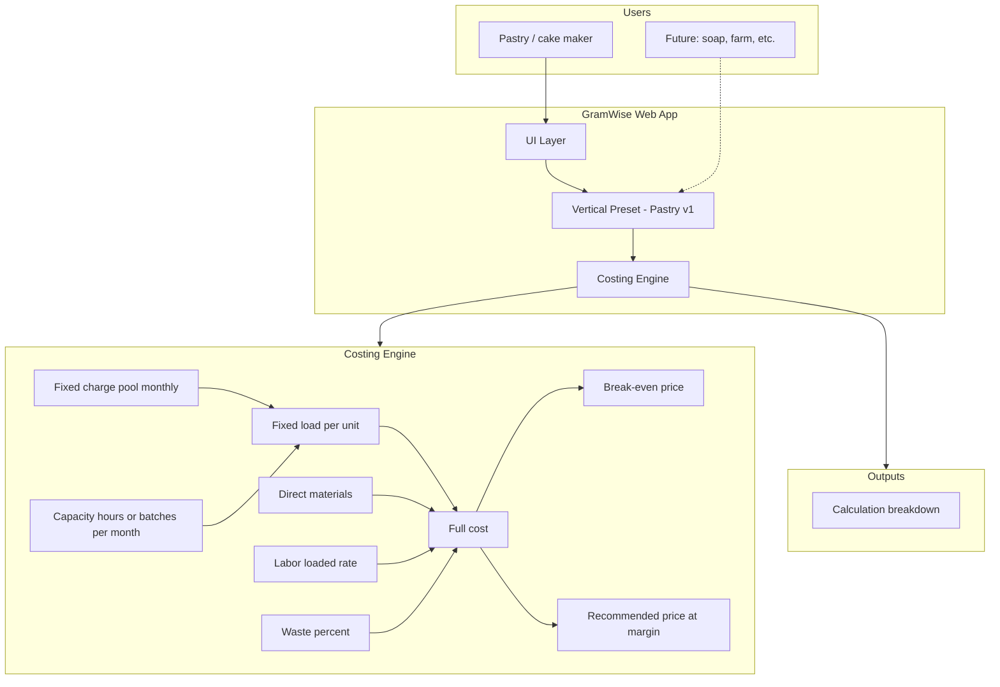
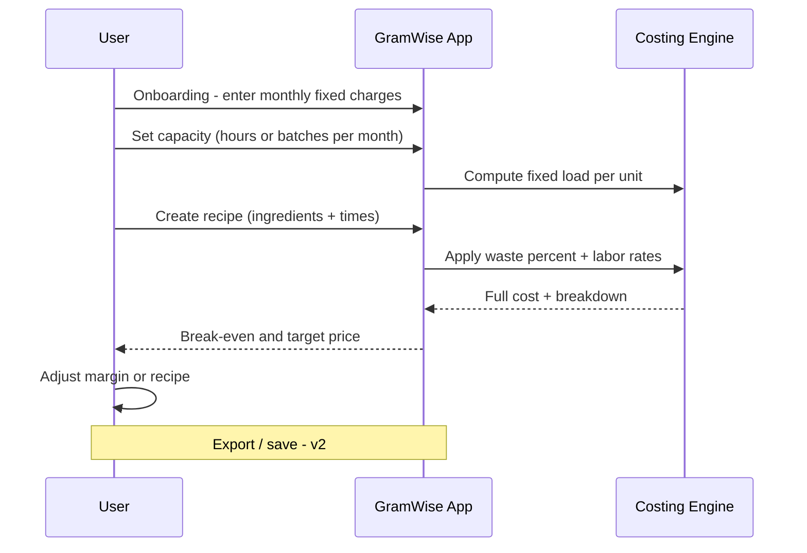
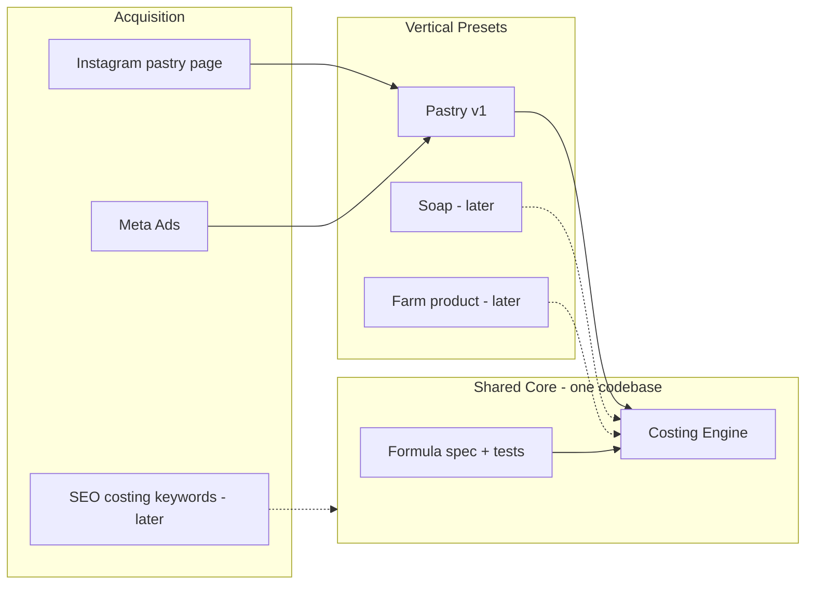
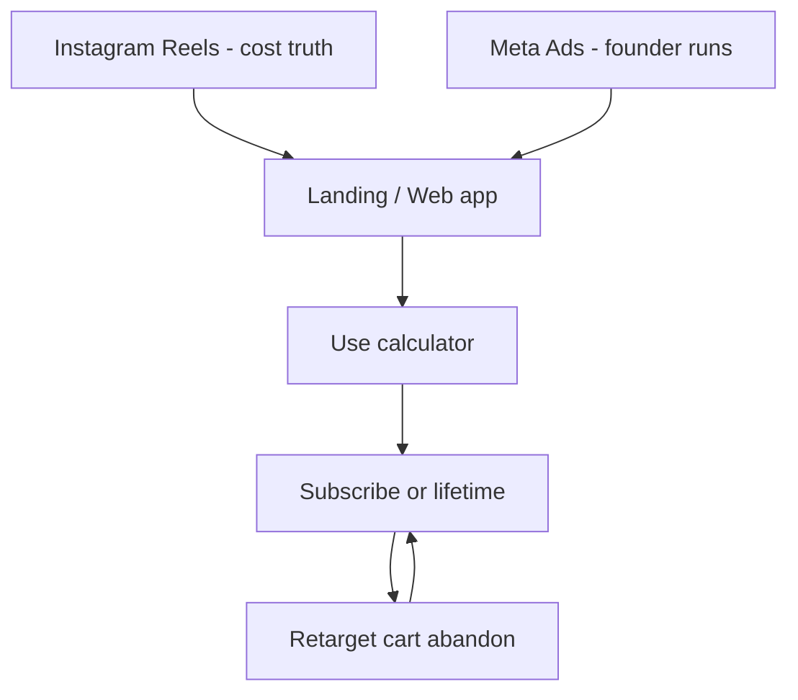

# GramWise — Project Brief

> **Paste this file** (`@PROJECT_BRIEF.md`) at the start of a new Cursor chat to restore full context.

---

## 1. Identity

| Field | Value |
|-------|--------|
| **Name** | GramWise |
| **Tagline** | True cost pricing — fixed overhead included |
| **Type** | Web application (costing engine + vertical presets) |
| **First vertical** | Pastry / custom & wedding cakes |
| **Later verticals** | Soap/cosmetics indie, farm transformation, etc. |
| **Repo (local)** | `C:\Users\DellVostro\Documents\fixload` |
| **GitHub** | https://github.com/abdouju30-prog/calculateur-rentabilit-p-tisserie |
| **Owner context** | Instagram pastry page (distribution); 4 years Meta ads experience; agriculture & pastry domain knowledge |

---

## 2. Problem

Artisans and small producers often price products using **ingredients + gut feel**. They omit or mis-allocate **fixed costs** (rent, energy, insurance, subscriptions, equipment). Tools built quickly (e.g. generic ChatGPT apps) look unprofessional and produce **inaccurate** prices (margin vs markup confusion, wrong units, no overhead pool).

**GramWise** computes **full cost** = direct materials + labor + **allocated fixed load per unit/batch**, then minimum price and target price at a chosen margin.

---

## 3. Solution (one sentence)

A **single costing engine** with **profession-specific presets**: user enters monthly fixed charges and production capacity, builds a recipe/production line, and gets a **transparent, auditable** minimum and recommended selling price.

---

## 4. Why this idea (decision log)

- Previous attempt: pastry pricing app via chat-coded UI → **not professional**, **math wrong** → root cause is **engine**, not marketing alone.
- Pattern is **reusable across domains** (same fixed-load logic).
- Not a saturated Canva pack; not a €750 Patisprix competitor — **mid-market** tool (subscription or lifetime).
- Instagram pastry page = **first acquisition channel**; Meta ads = scale (founder runs campaigns).

---

## 5. v1 Scope

### IN

- Fixed charge pool (monthly overhead categories)
- Capacity basis: hours/month **or** batches/month → **fixed cost per unit**
- Recipe: ingredient lines (qty, unit, cost/unit), time lines (prep, bake, finish), waste %
- Outputs: full cost, break-even price, recommended price (user margin %)
- **Calculation breakdown** visible (trust)
- Pastry preset (labels, default categories, example recipes)
- EN UI first; FR copy later
- 10 reference test cases validated against spreadsheet before launch

### OUT (v1)

- Multi-user / teams
- Accounting integrations (Pennylane, etc.)
- Invoicing, quotes, CRM
- Native mobile apps
- All verticals at once (only pastry preset shipped)

---

## 6. Business model (draft)

| Option | Price | Notes |
|--------|-------|-------|
| **A** | €29 / month | Recurring, supportable |
| **B** | €99 lifetime | Faster cash, pastry IG audience |
| **C** | Freemium | 3 saves free → paywall |

Decision deferred until MVP works and is **accurate**.

---

## 7. Tech direction (not implemented yet)

- Web app (SPA or Next.js) — **calculation module isolated and unit-tested**
- No “magic” LLM in the pricing path
- Deploy: Vercel or similar
- Auth/payments: phase 2 (Stripe after accuracy proven)

---

## 8. Success metrics

| Phase | Metric |
|-------|--------|
| Build | 10/10 test cases match reference Excel |
| Beta | 5 real bakers say “numbers match my reality” |
| GTM | CPA < 40% of first payment on Meta ads |
| Year 1 | €6k–40k gross (solo, realistic band) |

---

## 9. Session workflow (AgriGuide-style)

Rules: `.cursor/rules/project-end-compress.mdc`, `session-fin-handoff-block.mdc`. Template: `docs/HANDOFF_TEMPLATE.md`.

| Command | Meaning |
|---------|---------|
| **bonjour** | User `@` files or P0 from last message; handoff optional (3-row archive only) |
| **go** | Implement one P0 task |
| **fin** | **Compress:** handoff = fait · commit · P0 only; ≤5-line reply + starter block; commit if changed |
| **compresse** | Short reply; no narrative dump |
| **explique** | Detailed reply (not for handoff) |
| **scope** | Recall v1 IN/OUT only |

**End of any session:** save only inevitable project facts — never the discussion (see `project-end-compress.mdc`).

---

## 10. Diagrams

See section below (Mermaid). Render in GitHub, Cursor, or [mermaid.live](https://mermaid.live).

---

## 11. Architecture diagram



---

## 12. User journey diagram



---

## 13. Multi-domain model diagram



---

## 14. Go-to-market diagram



---

## 15. Formula reference (v1 — must be tested)

```
fixed_load_per_unit = total_monthly_fixed_charges / capacity_units_per_month

direct_materials = sum(quantity_i * cost_per_unit_i) * (1 + waste_percent)

direct_labor = sum(hours_phase_j * hourly_rate_j)

full_cost = direct_materials + direct_labor + fixed_load_per_unit

break_even_price = full_cost

recommended_price = full_cost / (1 - margin_percent)   // margin on selling price, not markup on cost
```

> **Critical:** Document and test margin vs markup. Never mix formulas across screens.

---

## 16. Related files in repo

| File | Purpose |
|------|---------|
| `PROJECT_BRIEF.md` | This document — context for new chats |
| `PRODUCT_SPEC.md` | Detailed IN/OUT |
| `ARCHITECTURE.md` | Technical structure (TBD) |
| `NEXT_SESSION_HANDOFF.md` | Last session state |
| `TODO.md` | P0–P3 tasks |

---

## 17. First P0 after brief

1. Finalize formula spec + 10 pastry test cases in `docs/TEST_CASES.md`
2. Choose stack (Next.js recommended)
3. Implement `engine/` with tests only — no UI polish until tests pass

---

*Created: 2026-05-21 · Project bootstrap.*
