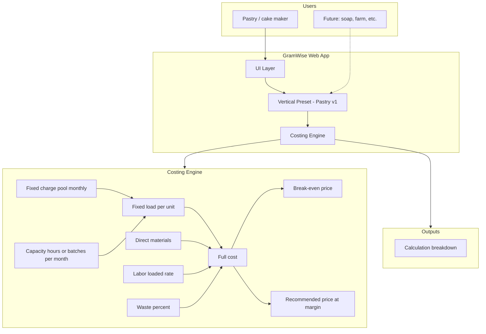
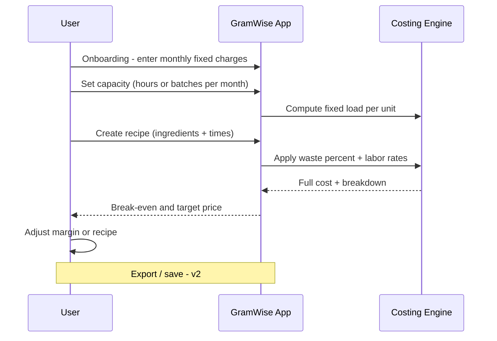
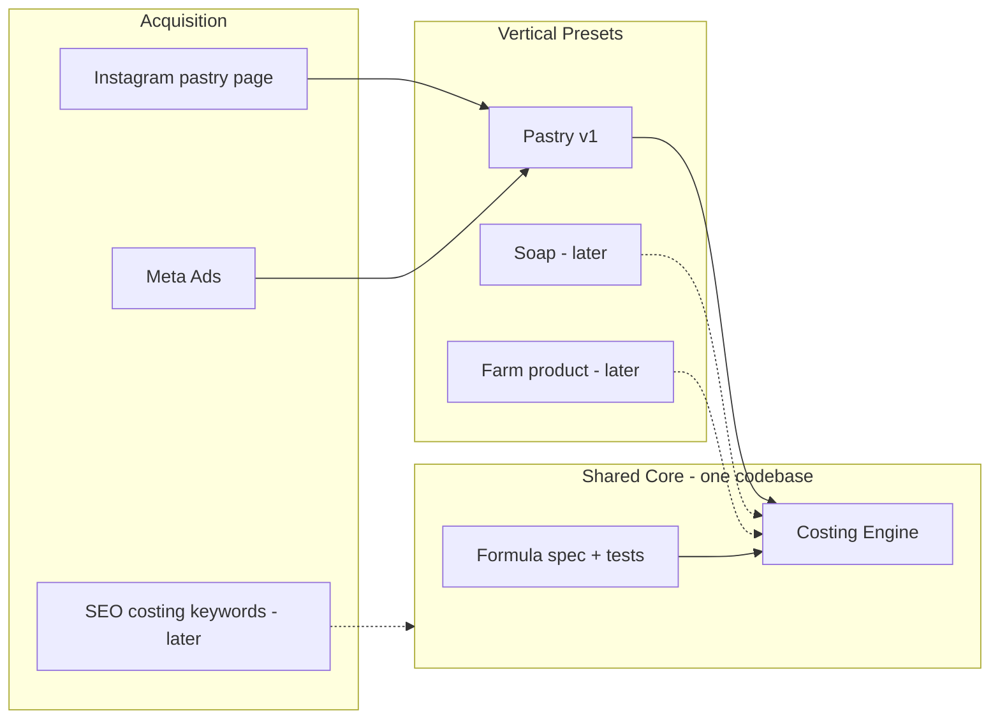
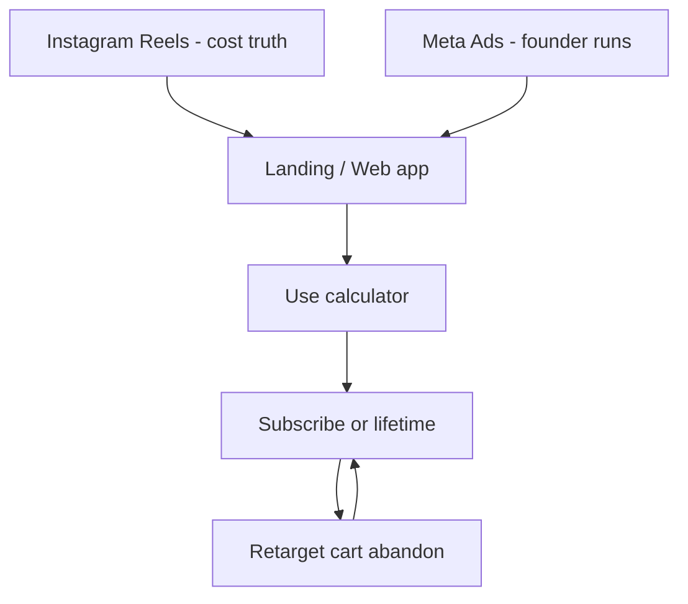

# Domain: diagrams

Render in GitHub, Cursor, or [mermaid.live](https://mermaid.live).

## Architecture

```mermaid
flowchart TB
  subgraph users [Users]
    Baker[Pastry / cake maker]
    Future[Future: soap, farm, etc.]
  end

  subgraph app [GramWise Web App]
    UI[UI Layer]
    Preset[Vertical Preset - Pastry v1]
    Engine[Costing Engine]
    UI --> Preset
    Preset --> Engine
  end

  subgraph engine_detail [Costing Engine]
    FC[Fixed charge pool monthly]
    CAP[Capacity hours or batches per month]
    ALLOC[Fixed load per unit]
    DIR[Direct materials]
    LAB[Labor loaded rate]
    WASTE[Waste percent]
    FC --> ALLOC
    CAP --> ALLOC
    ALLOC --> FULL[Full cost]
    DIR --> FULL
    LAB --> FULL
    WASTE --> FULL
    FULL --> MIN[Break-even price]
    FULL --> REC[Recommended price at margin]
  end

  Engine --> engine_detail

  subgraph outputs [Outputs]
    MIN
    REC
    BRK[Calculation breakdown]
  end

  Baker --> UI
  Future -.-> Preset
  Engine --> outputs
```

## User journey

```mermaid
sequenceDiagram
  participant U as User
  participant A as GramWise App
  participant E as Costing Engine

  U->>A: Onboarding - enter monthly fixed charges
  U->>A: Set capacity (hours or batches per month)
  A->>E: Compute fixed load per unit
  U->>A: Create recipe (ingredients + times)
  A->>E: Apply waste percent + labor rates
  E-->>A: Full cost + breakdown
  A-->>U: Break-even and target price
  U->>U: Adjust margin or recipe
  Note over U,A: Export / save - v2
```

## Multi-domain model

```mermaid
flowchart LR
  subgraph core [Shared Core - one codebase]
    ENG[Costing Engine]
    FORM[Formula spec + tests]
  end

  subgraph presets [Vertical Presets]
    P1[Pastry v1]
    P2[Soap - later]
    P3[Farm product - later]
  end

  subgraph channels [Acquisition]
    IG[Instagram pastry page]
    ADS[Meta Ads]
    SEO[SEO costing keywords - later]
  end

  P1 --> ENG
  P2 -.-> ENG
  P3 -.-> ENG
  FORM --> ENG

  IG --> P1
  ADS --> P1
  SEO -.-> core
```

## Go-to-market

```mermaid
flowchart TD
  IG[Instagram Reels - cost truth]
  ADS[Meta Ads - founder runs]
  LP[Landing / Web app]
  TRIAL[Use calculator]
  PAY[Subscribe or lifetime]
  IG --> LP
  ADS --> LP
  LP --> TRIAL
  TRIAL --> PAY
  PAY --> RET[Retarget cart abandon]
  RET --> PAY
```
